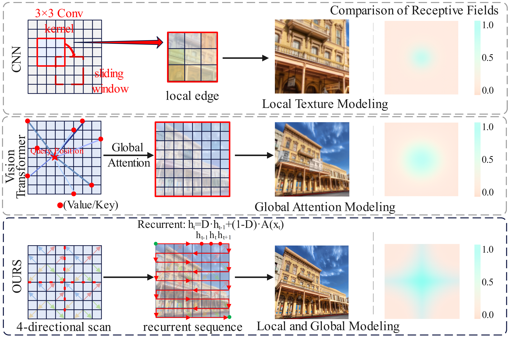
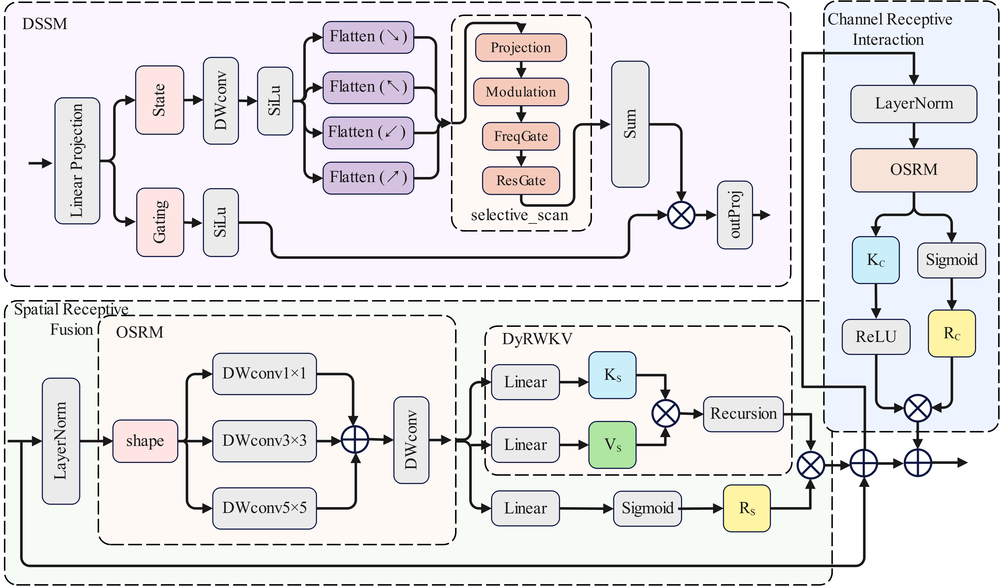

# [PRCV 2025 Oral] DyRSRNet: A Lightweight Super-Resolution Framework Based on Dynamic Recursive State-Space Networks

> **Abstract:**  

Image super-resolution (SR) aims to reconstruct high-quality high-resolution images from low-resolution inputs and has been widely applied in visual tasks such as medical imaging and remote sensing. Despite recent advances, existing methods still suffer from limited receptive field, insufficient spatial interaction, and a trade-off between resolution accuracy and lightweight design. To solve these issues, we propose a lightweight super-resolution framework based on dynamic recursive state-space modeling called DyRSRNet. Specifically, we design a lightweight dynamic state-space block (DyRWSSB) integrating the receptance weighted key value model for efficient long-sequence dependency modeling, thereby enhancing global structure and local texture restoration. In addition, we propose a visual recurrent shift encoding (VRSE) module to capture cross-directional spatial dependencies and channel interactions, enhancing the modeling of texture details. 
Furthermore, we propose a recursive context-aware state-space (RCSS) module, which enhances long-range context representation and structural restoration through bidirectional state-space modeling and direction-aware dynamic modulation mechanisms. Experimental results demonstrate that DyRSRNet achieves superior resolution performance on multiple SR benchmarks datasets, while significantly reducing parameter count and computational overhead. 
<p align="center">
  
</p>

<p align="center"><em>Comparison of receptive fields and modeling scopes of CNN, Transformer, and DyRSRNet.</em></p>

⭐If you find this work helpful, please consider starring 🌟 this repository!

---

## 📑 Contents

- [Visual Comparison](#visual-comparison)
- [Visual Results](#visual-results)
- [Network Architecture Overview](#network-architecture-overview)
- [Module Details](#module-details)
- [TODO](#todo)
- [Model Summary](#model-summary)
- [Results](#results)
- [Installation](#installation)
- [Training](#training)
- [Testing](#testing)
- [Citation](#citation)
- [License](#license)
- [Acknowledgements](#acknowledgements)

---

## 🔍 Visual Results

<p align="center">
  
</p>

---

## 🧠 Network Architecture Overview
<p align="center">
  
</p>

## 🔧 Module Details
<p align="center">
  
</p>

---

## ☑️ TODO

- [x] Release paper and code
- [x] Provide pretrained weights
- [x] Add model summary and benchmark table
- [x] Add Urban100 test results
- [ ] Upload ERF visualization script
- [ ] Extend to real-world degradations (JPEG, noise)
- [ ] Explore other restoration tasks (denoising, dehazing)

---

## 📄 Model Summary

| Model     | Scale | Params (K) | FLOPs (G) | Urban100 PSNR / SSIM |
|-----------|-------|------------|-----------|------------------------|
| DyRSRNet  | ×2    | 774        | 87.2      | 32.69 / 0.9349         |
| DyRSRNet  | ×3    | 784        | 39.2      | 28.49 / 0.8595         |
| DyRSRNet  | ×4    | 794        | 23.0      | 26.44 / 0.7958         |

---

## 🥇 Results

<details>
<summary>📈 Full Benchmark Comparison (click to expand)</summary>


</details>
# 📊 Quantitative Comparison on Benchmark Datasets

We compare our **DyRSRNet** with several state-of-the-art Super-Resolution (SR) methods on five standard benchmarks: Set5, Set14, BSD100, Urban100, and Manga109. PSNR/SSIM are evaluated on the Y channel of the transformed YCbCr space.

## 🔍 ×2 Super-Resolution

| Method     | Set5 (PSNR/SSIM)     | Set14 (PSNR/SSIM)    | BSD100 (PSNR/SSIM)   | Urban100 (PSNR/SSIM) | Manga109 (PSNR/SSIM) |
|------------|----------------------|------------------------|------------------------|------------------------|------------------------|
| Bicubic    | 33.66 / 0.9299       | 30.24 / 0.8688         | 29.56 / 0.8431         | 26.88 / 0.8403         | 30.80 / 0.9339         |
| SRCNN      | 36.66 / 0.9542       | 32.45 / 0.9067         | 31.36 / 0.8879         | 29.50 / 0.8946         | 35.60 / 0.9663         |
| CARN       | 37.76 / 0.9590       | 33.52 / 0.9166         | 32.09 / 0.8978         | 31.92 / 0.9256         | 38.36 / 0.9765         |
| IDN        | 37.83 / 0.9600       | 33.30 / 0.9148         | 32.08 / 0.8985         | 31.27 / 0.9196         | 38.01 / 0.9749         |
| IMDN       | 38.00 / 0.9605       | 33.63 / 0.9177         | 32.19 / 0.8996         | 32.17 / 0.9283         | 38.88 / 0.9774         |
| SMSR       | 38.00 / 0.9601       | 33.64 / 0.9179         | 32.17 / 0.8990         | 32.19 / 0.9284         | 38.76 / 0.9771         |
| FDIWN      | 38.07 / 0.9608       | 33.75 / 0.9201         | 32.23 / 0.9003         | 32.40 / 0.9305         | 38.85 / 0.9774         |
| FMEN       | 38.10 / 0.9609       | 33.75 / 0.9192         | 32.26 / 0.9007         | 32.41 / 0.9311         | 38.95 / 0.9778         |
| HPUN       | 38.10 / 0.9608       | 33.78 / 0.9201         | 32.28 / 0.9010         | 32.49 / 0.9318         | 39.08 / 0.9779         |
| BCRN       | 38.04 / 0.9606       | 33.66 / 0.9183         | 32.21 / 0.9000         | 32.28 / 0.9294         | 38.99 / 0.9777         |
| NGswin     | 38.05 / 0.9610       | 33.79 / 0.9199         | 32.27 / 0.9008         | 32.53 / 0.9324         | 38.97 / 0.9777         |
| CFIN       | 38.14 / 0.9610       | 33.80 / 0.9199         | 32.26 / 0.9006         | 32.48 / 0.9311         | 38.97 / 0.9773         |
| DyRSRNet   | 38.12 / 0.9609       | 33.76 / 0.9186         | 32.36 / 0.9037         | 32.69 / 0.9349         | 39.25 / 0.9783         |

## 🔍 ×3 Super-Resolution

| Method     | Set5 (PSNR/SSIM)     | Set14 (PSNR/SSIM)    | BSD100 (PSNR/SSIM)   | Urban100 (PSNR/SSIM) | Manga109 (PSNR/SSIM) |
|------------|----------------------|------------------------|------------------------|------------------------|------------------------|
| Bicubic    | 30.40 / 0.8686       | 27.54 / 0.7741         | 27.21 / 0.7389         | 24.46 / 0.7349         | 26.95 / 0.8565         |
| SRCNN      | 32.75 / 0.9090       | 29.29 / 0.8215         | 28.41 / 0.7863         | 26.24 / 0.7991         | 30.48 / 0.9117         |
| CARN       | 34.29 / 0.9255       | 30.29 / 0.8407         | 29.06 / 0.8034         | 28.06 / 0.8493         | 33.50 / 0.9440         |
| IDN        | 34.11 / 0.9253       | 29.99 / 0.8354         | 28.95 / 0.8013         | 27.42 / 0.8359         | 32.71 / 0.9381         |
| IMDN       | 34.36 / 0.9270       | 30.32 / 0.8417         | 29.09 / 0.8046         | 28.17 / 0.8519         | 33.61 / 0.9446         |
| SMSR       | 34.40 / 0.9270       | 30.33 / 0.8412         | 29.10 / 0.8050         | 28.25 / 0.8536         | 33.68 / 0.9445         |
| FDIWN      | 34.52 / 0.9281       | 30.42 / 0.8438         | 29.14 / 0.8065         | 28.36 / 0.8567         | 33.77 / 0.9456         |
| FMEN       | 34.45 / 0.9275       | 30.40 / 0.8435         | 29.17 / 0.8063         | 28.33 / 0.8562         | 33.86 / 0.9462         |
| HPUN       | 34.58 / 0.9282       | 30.46 / 0.8445         | 29.19 / 0.8073         | 28.39 / 0.8582         | 33.93 / 0.9467         |
| NGswin     | 34.52 / 0.9282       | 30.53 / 0.8456         | 29.19 / 0.8078         | 28.52 / 0.8603         | 33.89 / 0.9470         |
| CFIN       | 34.65 / 0.9289       | 30.45 / 0.8443         | 29.18 / 0.8071         | 28.49 / 0.8583         | 33.89 / 0.9464         |
| DyRSRNet   | 34.58 / 0.9290       | 30.49 / 0.8470         | 29.24 / 0.8107         | 28.49 / 0.8595         | 34.03 / 0.9482         |

## 🔍 ×4 Super-Resolution

| Method     | Set5 (PSNR/SSIM)     | Set14 (PSNR/SSIM)    | BSD100 (PSNR/SSIM)   | Urban100 (PSNR/SSIM) | Manga109 (PSNR/SSIM) |
|------------|----------------------|------------------------|------------------------|------------------------|------------------------|
| Bicubic    | 28.42 / 0.8104       | 26.00 / 0.7027         | 25.96 / 0.6675         | 23.14 / 0.6577         | 24.89 / 0.7866         |
| SRCNN      | 30.48 / 0.8626       | 27.50 / 0.7513         | 26.90 / 0.7101         | 24.52 / 0.7221         | 27.58 / 0.8555         |
| CARN       | 32.13 / 0.8937       | 28.60 / 0.7806         | 27.58 / 0.7349         | 26.07 / 0.7837         | 30.47 / 0.9084         |
| IDN        | 31.82 / 0.8903       | 28.25 / 0.7730         | 27.41 / 0.7297         | 25.41 / 0.7632         | 29.41 / 0.8942         |
| IMDN       | 32.21 / 0.8948       | 28.58 / 0.7811         | 27.56 / 0.7353         | 26.04 / 0.7838         | 30.45 / 0.9075         |
| SMSR       | 32.12 / 0.8932       | 28.55 / 0.7808         | 27.55 / 0.7351         | 26.11 / 0.7868         | 30.54 / 0.9085         |
| FDIWN      | 32.23 / 0.8955       | 28.66 / 0.7829         | 27.62 / 0.7380         | 26.28 / 0.7919         | 30.63 / 0.9098         |
| FMEN       | 32.24 / 0.8955       | 28.70 / 0.7839         | 27.63 / 0.7379         | 26.28 / 0.7908         | 30.70 / 0.9107         |
| HPUN       | 32.38 / 0.8969       | 28.72 / 0.7847         | 27.66 / 0.7393         | 26.36 / 0.7947         | 30.83 / 0.9124         |
| BCRN       | 32.23 / 0.8951       | 28.67 / 0.7827         | 27.59 / 0.7365         | 26.14 / 0.7866         | 30.58 / 0.9087         |
| NGswin     | 32.33 / 0.8963       | 28.78 / 0.7859         | 27.66 / 0.7396         | 26.45 / 0.7963         | 30.80 / 0.9128         |
| CFIN       | 32.49 / 0.8985       | 28.74 / 0.7849         | 27.68 / 0.7396         | 26.39 / 0.7946         | 30.73 / 0.9124         |
| DyRSRNet   | 32.49 / 0.8979       | 28.77 / 0.7846         | 27.67 / 0.7391         | 26.44 / 0.7958         | 31.24 / 0.9156         |

---

## 🛠️ Installation

```bash
conda create -n dyrsrnet python=3.9
conda activate dyrsrnet
pip install -r requirements.txt
```

Install selective scan and RWKV module:
```bash
pip install causal_conv1d==1.0.0
pip install mamba_ssm==1.0.1
```

---

---

## 🏋️ Training

### Train on Super-Resolution

1. Please download the training datasets (DIV2K + Flickr2K) and place them under `datasets/DF2K`. Evaluation datasets (Set5, Set14, BSD100, Urban100, Manga109) should be placed under `datasets/SR`.

2. Our training follows the BasicSR framework, adapted to DyRSRNet architecture. Configuration files are provided in `options/train`.

```bash
# DyRSRNet for classic SR (×2/×3/×4), using cropped LR inputs of size 64×64
python -m torch.distributed.launch --nproc_per_node=8 --master_port=1234 basicsr/train.py -opt options/train/train_DyRSRNet_SR_x2.yml --launcher pytorch
python -m torch.distributed.launch --nproc_per_node=8 --master_port=1234 basicsr/train.py -opt options/train/train_DyRSRNet_SR_x3.yml --launcher pytorch
python -m torch.distributed.launch --nproc_per_node=8 --master_port=1234 basicsr/train.py -opt options/train/train_DyRSRNet_SR_x4.yml --launcher pytorch
```

3. Training logs and models will be saved under `experiments/`. We adopt `Adam` optimizer with cosine decay learning rate and half-step restarts.

> Note: Our `DyRSRNet` uses patch embedding and RWKV-based state modeling. Please ensure your training resolution and crop sizes are compatible with transformer-style tokenization.


### Training Classic SR (×2, ×3, ×4):

```bash
python -m torch.distributed.launch --nproc_per_node=4 --master_port=1234 basicsr/train.py -opt options/train/train_DyRSRNet_SR_x4.yml --launcher pytorch
```

Datasets should be prepared under `datasets/DF2K` and `datasets/SR`.

---

## 🔎 Testing

### Test on Super-Resolution

1. Download pretrained weights and place them under `experiments/pretrained_models/`. Evaluation datasets should be placed under `datasets/SR`.

```bash
# Evaluate DyRSRNet on benchmark datasets
python basicsr/test.py -opt options/test/test_DyRSRNet_SR_x2.yml
python basicsr/test.py -opt options/test/test_DyRSRNet_SR_x3.yml
python basicsr/test.py -opt options/test/test_DyRSRNet_SR_x4.yml
```

Results will be saved to `results/DyRSRNet/`.

### Optional: Real Image Denoising (Baseline-Compatible)

> If your model supports real-image denoising (e.g., SIDD/DND), you may follow the existing MambaIR training/testing pipeline with adjusted configuration and model definitions. Replace backbone with DyRSRNet where applicable.

```bash
# Example (for compatibility):
cd realDenoising
python setup.py develop --no_cuda_ext
python -m torch.distributed.launch --nproc_per_node=8 basicsr/train.py -opt options/train/train_DyRSRNet_RealDN.yml --launcher pytorch
```


Download pretrained weights and place in `experiments/pretrained_models/`. Then:

```bash
python basicsr/test.py -opt options/test/test_DyRSRNet_SR_x4.yml
```

The visual results will be saved to `results/DyRSRNet`.

---

## 📜 Citation

If you find DyRSRNet helpful in your research or application, please cite:

```bibtex
@article{he2025dyrsrnet,
  title={DyRSRNet: A Lightweight Super-Resolution Framework Based on Dynamic Recursive State-Space Networks},
  author={Sijia He, Ziyan Wei, Liejun Wang, and Zhiqing Guo},
  journal={PRCV},
  year={2025}
}
```

---

## 🧾 License

This repository is released under the [Apache 2.0 License](LICENSE).

---

## 🙏 Acknowledgements

Our work is inspired by previous studies such as [RWKV](https://github.com/BlinkDL/RWKV-LM), [Mamba](https://github.com/state-spaces/mamba), and [BasicSR](https://github.com/XPixelGroup/BasicSR). We thank the authors for their valuable contributions to the community.


